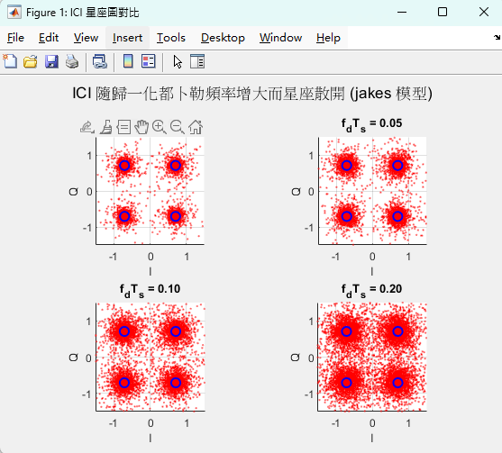
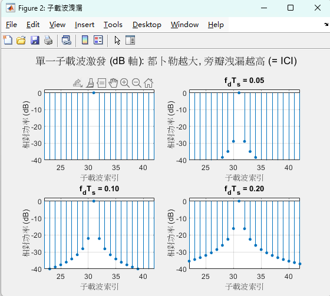
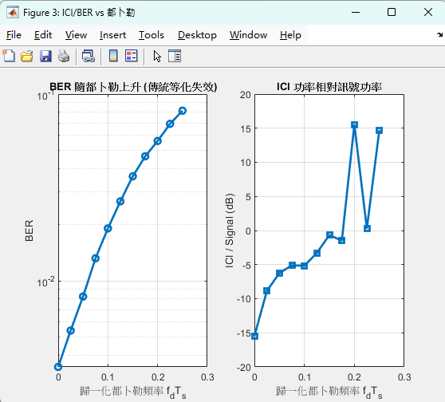

# SIMO-OFDM 模擬：從專題修正到時變通道 ICI 分析

本專案以一個 SIMO-OFDM（單發多收正交分頻多工）通訊系統模擬為基礎，
記錄從**原始專題程式的修正**到**延伸出時變通道 ICI 分析**的完整演進。

> 原始版本為大學專題成果（多接收天線 BER 模擬）。本 repo 在其基礎上
> 修正了雜訊建模與等化器實作的問題，並進一步引入時變通道，
> 複現高移動性場景下 OFDM 子載波正交性被破壞、產生載波間干擾（ICI）的現象。

---

## 系統模型

單發射、多接收天線的 OFDM 系統：發射端經 S/P → IDFT → 加循環前綴（CP）→ P/S 發送；
每根接收天線經過各自的多徑通道與雜訊，接收端去 CP → DFT → 等化 → 判別。

- 調變：QPSK
- 子載波數 N、循環前綴長度 M、通道階數 L
- 等化器：ZF / MMSE（可切換）
- 通道：靜態多徑 / 時變（都卜勒）

實際參數值：
- 多天線 BER 模擬（v2）：N = 8, M = 7, L = 5, P = 15, 接收天線數掃描 2–6
- 時變通道 ICI 分析：N = 64, M = 16, L = 5, 歸一化都卜勒 fdTs 掃描 0–0.25

---

## 演進三階段

### 第一階段：原始專題（baseline）
多接收天線下的 BER 模擬，驗證 BER 隨接收天線數增加而下降（空間分集增益）。

### 第二階段：v2 修正
修正原始程式在物理建模上的問題（詳見 `docs/FIXES.md`）：
- 雜訊功率改用量測訊號功率（原用通道功率，物理定義錯誤）
- 修正複數雜訊遺漏的因子 2
- 等化器做成 ZF / MMSE 可切換（原程式實作與報告所述不符）
- 每根天線獨立雜訊（原共用同一雜訊向量，高估分集增益）
- 移除對不上系統的理論 BER 曲線；修正指數擬合的觸底退化

數值驗證：BER 隨天線數遞減、MMSE 在低天線數優於 ZF。

### 第三階段：時變通道 ICI 分析（延伸）
引入時變通道（都卜勒效應），複現 OFDM 在高移動性下的核心難題——ICI。
- 兩種時變模型：簡化相位模型（教學）/ Jakes 模型（業界標準）
- 三個產出：星座圖散開、子載波洩漏（dB 軸）、BER/ICI vs 歸一化都卜勒
- 理論推導見 `docs/ICI_THEORY.md`

---

## 檔案結構

```
src/
  multiple_antenna_compare_MONTE_v2.m   主模擬（Monte Carlo BER vs 天線數，ZF/MMSE）
  multiple_antenna_IQ_compare_v2.m      星座圖 + 單次 BER 觀察
  timevarying_channel_ICI.m             時變通道 ICI 分析（三個 demo）
docs/
  FIXES.md           v2 相對原始程式的逐項修正與原因
  A_STAGE_NOTES.md   時變通道 ICI 階段筆記（含 CFO/ICI 除錯記錄）
  ICI_THEORY.md      ICI 完整理論推導（正交性 → 時變破壞 → 矩陣形式）
  REFERENCES.md      參考文獻與出處說明
```

---

## 執行方式

需要 MATLAB（建議 R2020 以上；指數擬合改用 `polyfit`，不需 Curve Fitting Toolbox）。

```matlab
% 多天線 BER 對比（可在檔內切換 eq_type = 'ZF' 或 'MMSE'）
run('src/multiple_antenna_compare_MONTE_v2.m')

% 星座圖觀察
run('src/multiple_antenna_IQ_compare_v2.m')

% 時變通道 ICI（可切換 chan_mode = 'phase' 或 'jakes'）
run('src/timevarying_channel_ICI.m')
```

---

## 主要結果

- **空間分集**：BER 隨接收天線數增加而下降。
- **等化器對比**：MMSE 在低訊雜比 / 低天線數時優於 ZF。
- **ICI**：歸一化都卜勒頻率增大時，星座圖散開、子載波旁瓣洩漏上升、
  BER 出現不隨 SNR 消失的誤碼地板，驗證傳統單抽頭等化在高移動性下失效。

### 時變通道 ICI 視覺化

星座圖隨歸一化都卜勒頻率增大而散開（Jakes 模型）：



子載波洩漏（dB 軸）：fdTs=0 時正交完美，都卜勒增大時旁瓣逐漸升高：



BER 與 ICI 功率隨歸一化都卜勒頻率上升：



---

## 開發過程的技術反思

本專案兩個階段各記錄了一個有價值的除錯案例（詳見對應 docs）：

1. **建模錯誤 vs 程式 bug**：原始雜訊模型語法正確、資料流自洽，
   但物理定義錯誤（訊號功率項、複數因子 2）。修正過程區分了
   「程式跑得出數字」與「數字在物理上正確」。

2. **CFO 與 ICI 的混淆**：時變模型初版讓所有通道路徑同步旋轉，
   等效於固定載波頻偏（CFO）而非 ICI，症狀是 BER 異常暴衝。
   透過「子載波洩漏輕微但 BER 慘烈」這個矛盾定位問題，
   改為各路徑獨立衰落後修正。學界亦明確區分 CFO 與都卜勒時變為
   ICI 的不同成因。
