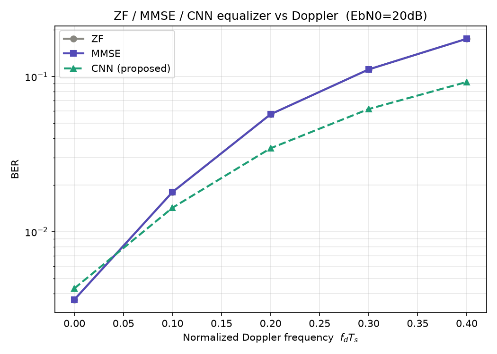
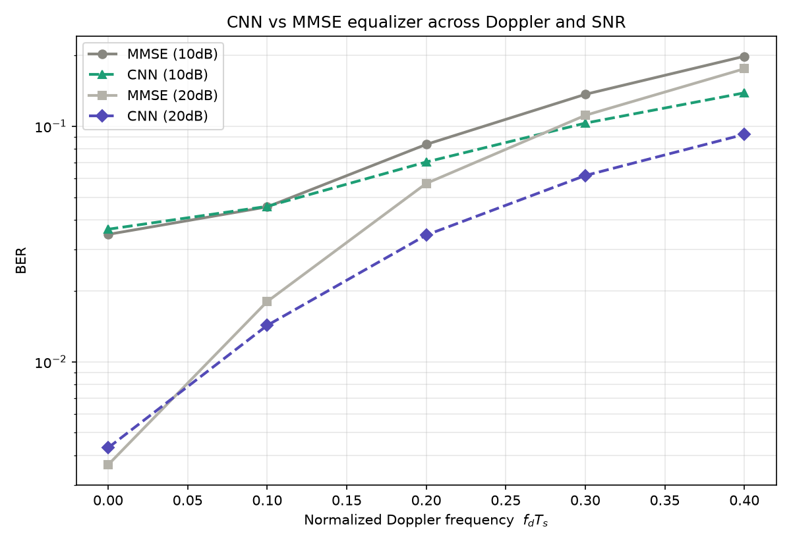

[English](README.md) | **繁體中文**

# DNN 等化器：用 1D-CNN 對抗時變通道 ICI

本資料夾是 SIMO-OFDM 專案的延伸（C 階段）：在時變通道（都卜勒效應）下，
傳統 ZF/MMSE 等化器因載波間干擾（ICI）而失效，本階段以深度學習方法
（1D-CNN）學習 ICI 的鄰近子載波洩漏結構，在高都卜勒場景超越傳統等化。

> **核心結果**：在 EbN0=20dB、歸一化都卜勒 fdTs=0.4 的壓力測試下，
> CNN 將 BER 從 MMSE 的 0.175 降至 0.087（**約砍半，改善 47%**），
> 且改善幅度隨都卜勒增強而擴大。

---

## 方法

ICI 在頻域上表現為通道矩陣的非對角項——能量從一個子載波洩漏到鄰近子載波
（帶狀矩陣結構，理論見上層 `../docs/ICI_THEORY.md`）。據此：

- **輸入**：每個中心子載波 + 左右各 W 個鄰居（窗口 2W+1），
  每點 4 特徵 [Re(y), Im(y), Re(d), Im(d)]
- **網路**：3 層 1D 卷積（kernel=3）+ 全連接頭
- **輸出**：中心子載波的 QPSK 類別（4 類分類，交叉熵）
- **設計依據**：CNN 卷積核天生「看鄰居」，能捕捉 ICI 的帶狀洩漏結構——
  這是單點 MLP 做不到的。方法選擇參考主流文獻（1D-CNN 在時變通道
  優於 LS/MMSE/FFNN）。

採用 model-aided 設定（將通道估計 d 餵給網路），與 MMSE 公平對比。

---

## 主要結果

### 成果圖

ZF / MMSE / CNN 隨歸一化都卜勒的 BER 對比（EbN0=20dB，CNN 在高都卜勒砍半）：



兩種 SNR 下 CNN 相對 MMSE 的優勢對比（高 SNR 下差距更大）：



### CNN vs MMSE（EbN0=20dB）

| fdTs | MMSE | CNN | 改善 |
|------|------|-----|------|
| 0.10 | 1.80e-2 | 1.43e-2 | +21% |
| 0.20 | 5.72e-2 | 3.45e-2 | +40% |
| 0.30 | 1.11e-1 | 6.18e-2 | +44% |
| 0.40 | 1.75e-1 | 9.24e-2 | +47% |

關鍵觀察：
1. **CNN 優勢專屬於 ICI 場景**：fdTs≈0（無 ICI）時 CNN 略輸 MMSE，
   證明方法的誠實性——不在不該贏時假裝贏。
2. **SNR 是關鍵槓桿**：高 SNR 下雜訊不再主導、ICI 成為唯一誤差來源，
   CNN 對 ICI 的優勢更純粹顯現（同樣 fdTs，20dB 的改善遠大於 10dB）。
3. **改善隨都卜勒擴大**：ICI 越強，CNN 越把 MMSE 甩開。

---

## 檔案

```
src/
  gen_data.py      OFDM 資料生成器，產 (Y,D,X) 三元組存 .mat（static/jakes，可設 fdTs）
  train_eq.py      里程碑1：靜態通道 MLP 等化器（驗證 pipeline，追平 MMSE）
  train_cnn.py     里程碑2：時變通道 1D-CNN 等化器（單點 fdTs 對比）
  sweep_fdts.py    掃多個 fdTs，產 ZF/MMSE/CNN 三線分岔圖
  plot_compare.py  把兩組 sweep 結果畫成雙 SNR 對照圖
docs/
  C_STAGE_NOTES.md C 階段完整筆記（方法、結果、除錯記錄）
figures/
  sweep_20dB.png        主成果圖
  compare_10_20dB.png   雙 SNR 對照圖
```

---

## 執行（需 PyTorch + CUDA）

```bash
# 里程碑 1：靜態通道，驗證 pipeline
python gen_data.py --mode static --out data/static.mat
python train_eq.py --data data/static.mat --epochs 15

# 里程碑 2：時變通道單點對比
python gen_data.py --mode jakes --fdTs 0.2 --out data/jakes02.mat
python train_cnn.py --data data/jakes02.mat --W 4 --epochs 25

# 完整掃描 + 對照圖
python sweep_fdts.py --fdts 0 0.1 0.2 0.3 0.4 --epochs 50 --EbN0 20 --out sweep_20dB.mat
python sweep_fdts.py --fdts 0 0.1 0.2 0.3 0.4 --epochs 50 --EbN0 10 --out sweep_10dB.mat
python plot_compare.py --a sweep_10dB.mat --b sweep_20dB.mat --la 10dB --lb 20dB --out compare_10_20dB.png
```

---

## 開發過程的技術反思

**MSE vs 分類的建模選擇**：初版用 MSE 回歸，loss 正常下降但 BER 全錯——
網路輸出數值接近目標卻判別象限全錯。根因是等化的本質是「判對象限」=分類問題，
非「逼近數值」=回歸。改交叉熵分類後立刻正常。

這與專案其他階段的除錯是同一類智慧：當兩個本該一致的指標矛盾時
（loss 降但 BER 全錯），矛盾本身就是定位問題的線索。

---

## 場景說明

fdTs=0.3~0.4 屬壓力測試場景（接近高鐵/高速移動的都卜勒上限或略超），
物理上合理、學界有模擬此範圍，但非典型行動通訊條件。
此設定用於凸顯 CNN 對強 ICI 的處理能力。
